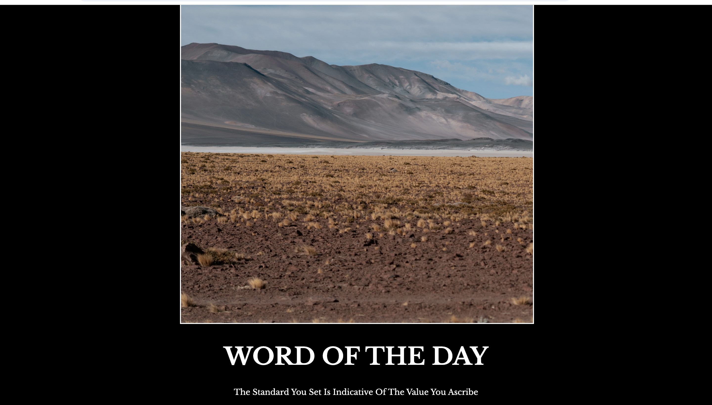

# Motivational Meme / Word of the Day

A simple, static web page designed to display a daily motivational quote and an accompanying image. The project features a minimalist dark-themed design with custom typography.

## 📖 Description

This project is a single-page website that presents a "Word of the Day." It uses a clean layout to focus the user's attention on the visual element and the text.



**Quote included:**
> "The Standard You Set Is Indicative Of The Value You Ascribe"

## 🛠️ Built With

* **HTML5:** Semantic structure for the content.
* **CSS3:** Custom styling for layout and design.
* **Google Fonts:** Utilizes [Libre Baskerville](https://fonts.google.com/specimen/Libre+Baskerville) for a classic, serif typography look.

## 📂 Project Structure

```text
/
├── index.html          # Main HTML structure
├── style.css           # Stylesheet for design and layout
└── assets/
    └── images/
        ├── ytalo-marinho-jdBs5h1fNoY-unsplash.jpg  # Main display image
        └── preview.jpg                             # Project screenshot
```

🚀 How to Run
1. Download or clone the repository.

2. Ensure the file structure matches the tree above (specifically the assets/images/ folder).

3. Open index.html in any modern web browser.

🎨 Design Features
- Dark Mode: Black background with white text for high contrast.

- Centered Layout: Content is contained within a 50% width div, centered on the screen.

- Typography: Large, uppercase headers styled with specific font families.

📸 Credits
- Photography: Image by Ytalo Marinho via Unsplash.

- Fonts: Libre Baskerville provided by Google Fonts.

